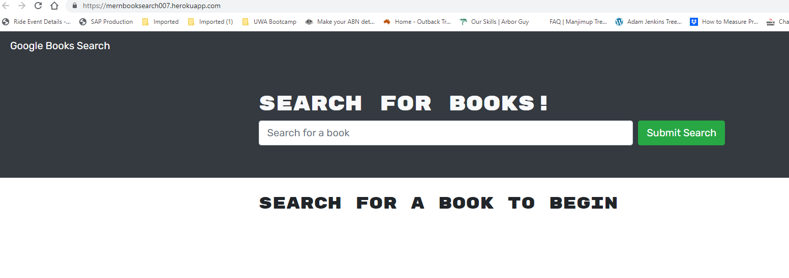

# Mern_Booksearch
Booksearch engine using Googlebooks API refactored from Rest to Mern

# Tech Blog  

  

## Description

The application allows visitors to the Site to search for books on the Googlebooks API.  A visitor can create a User profile, which allows them to choose books from the search and save them.  A User can view their saved books, and delete them once no longer required.  The application uses the MERN stack for saving User profiles and book searches.

 
  
## Table of Contents

- [Installation](#installation-notes)
- [Usage](#usage)
- [Features](#features)
- [Credits](#credits)
- [Contributing](#contributing)
- [Questions](#questions)
- [License](#license)

 

## Installation Notes  

  The application is deployed on Heroku using MongoDB and Atlas.  If preferred, the application can be cloned to a personal computer, subject to licensing concerns.  Note that the original Rest code was provided by UWA as part of the Full Stack Web Developers Bootcamp.  Once on your computer, run npm run install, followed by npm run develop.  The application should open automatically on your browser.  Use React Version 17.  Not tested for later versions.  Note versions used in the package.json, as not tested with later versions.   

 

## Usage 

  The application is intuitive for users.  A User must be logged in to save books from their search.  A person visiting the site can conduct a search, but cannot save.  A User must be logged in to view their saved books, and to delete books from the saved books list.   

  The application is deployed at:  https://mernbooksearch007.herokuapp.com/
 
   

  The Git repository for the applicaton is held at:  https://github.com/Cancer2806/Mern_Booksearch.  The original REST code can be found at: https://github.com/Cancer2806/Rest_Booksearch

 

  Following are screenshots showing the application in use:  

Login Screen:
 
  
This screen allows a previous User to Login.  It also provides a button to allow a new User to Signup and create a profile.   

 

Saved Books:
 
  
Provides a view of the Books saved by the User and allows the User to delete a book if no longer wanted   

 

Search Screen:
 
  
Landing page for the application.  From here, a visitor can conduct a book search or choose to Signup and create a profile.  Similarly, a previously signed up User can log in.   

 

## Features  

  Users passwords are encrypted using bcrypt.  JWT Tokens are used for User authentication, once the User has logged in.   

 

## Credits  

  The UWA Full Stack Web Developers Bootcamp provided the starter code as part of the Bootcamp.  Heroku and Atlas were used for Deployment of the App.  The app makes use of the full MERN stack.  Apollo and GraphQL were used for route control and database access.      

 

## Contributing  

  Please advise by email if there are any contributions you'd like to make.      

 

## Questions
Please use email for any questions you may have   

Github:  https://github.com/Cancer2806

Email:  frank.lavery@westnet.com.au

 

## License
This project is licensed under [MIT](https://opensource.org/licenses/MIT).
